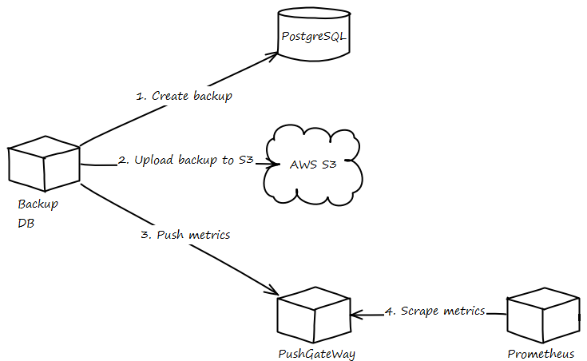

# Backup files

Service for creating arbitrary files backups and uploading them to AWS S3 (or S3-compatible service).
Also sends metrics to Prometheus through Pushgateway.

## Build arguments

|       Name       |           Description             |
|------------------|-----------------------------------|
| ALPINE_IMAGE_TAG | Base Docker image tag             |
| CURL_VERSION     | cURL dependency version           |
| BASH_VERSION     | Bash dependency version           |
| GLIBC_VERSION    | glibc dependency version          |
| AWS_CLI_VERSION  | AWS (cli v2) dependency version   |
| BACKUP_PATH      | Root path to find paths to backup |

## Variables

|         Name          |                    Description                    |        Default       |
|-----------------------|---------------------------------------------------|----------------------|
| BACKUP_VOL_NAME       | Docker volume name to mount as source             |                      |
| BACKUP_PATH           | Root path to find paths to backup                 | /backup              |
| PATHS_TO_BACKUP       | Paths to include in backup (separated by space)   |                      |
| PATHS_TO_EXCLUDE      | Paths to exclude from backup (separated by space) |                      |
| WORK_PATH             | Temporal path for working                         | /tmp/backup          |
| UPLOAD_BUCKET         | Bucket name for uploads                           | backup-files         |
| UPLOAD_ENDPOINT_URL   | URL for uploads (S3-compatible)                   |                      |
| AWS_ACCESS_KEY_ID     | AWS credentials                                   | changeme             |
| AWS_SECRET_ACCESS_KEY | AWS credentials                                   | changeme             |
| AWS_DEFAULT_REGION    | AWS region                                        | eu-west-1            |
| AWS_OUTPUT            | AWS output format                                 | json                 |
| PUSHGATEWAY_HOST      | Pushgateway hostname                              | pushgateway:9091     |
| PUSHGATEWAY_JOB       | Pushgateway job name                              | ${UPLOAD_BUCKET}     |
| PUSHGATEWAY_LABEL     | Pushgateway label value                           | ${PUSHGATEWAY_JOB}   |

## Metrics

|                                Name                                    |                        Description                       |
|------------------------------------------------------------------------|----------------------------------------------------------|
| backup_duration_seconds{label="${PUSHGATEWAY_LABEL}",stage="dump"}     | Duration of create dump execution in seconds             |
| backup_duration_seconds{label="${PUSHGATEWAY_LABEL}",stage="compress"} | Duration of compress dump execution in seconds           |
| backup_duration_seconds{label="${PUSHGATEWAY_LABEL}",stage="upload"}   | Duration of upload backup to S3 execution in seconds     |
| backup_size_bytes{label="${PUSHGATEWAY_LABEL}"}                        | Duration of the script execution in seconds              |
| backup_created_date_seconds{label="${PUSHGATEWAY_LABEL}"}              | Created date in seconds                                  |
